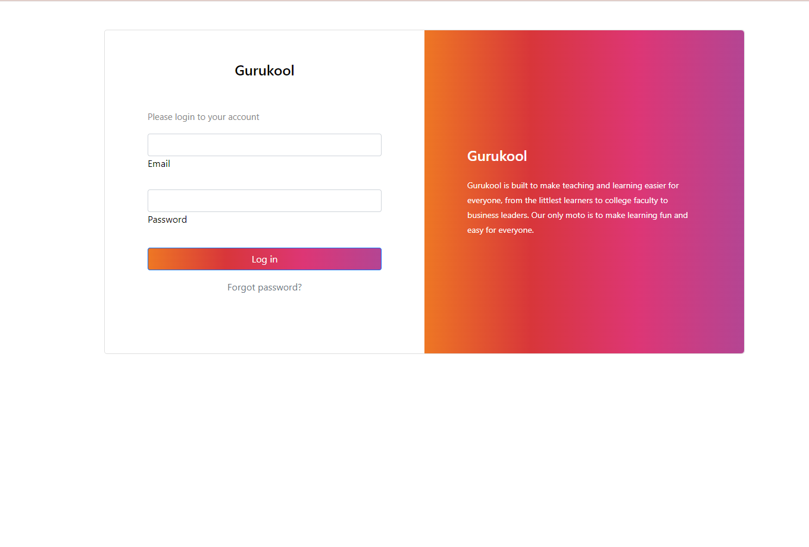
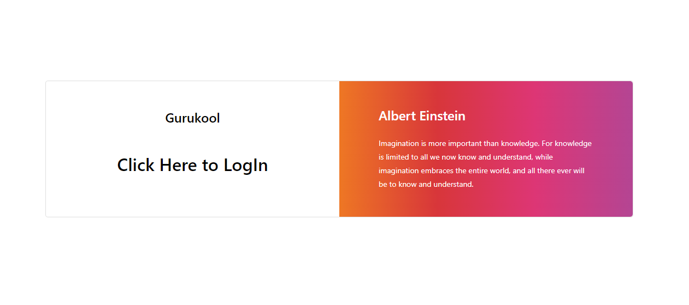
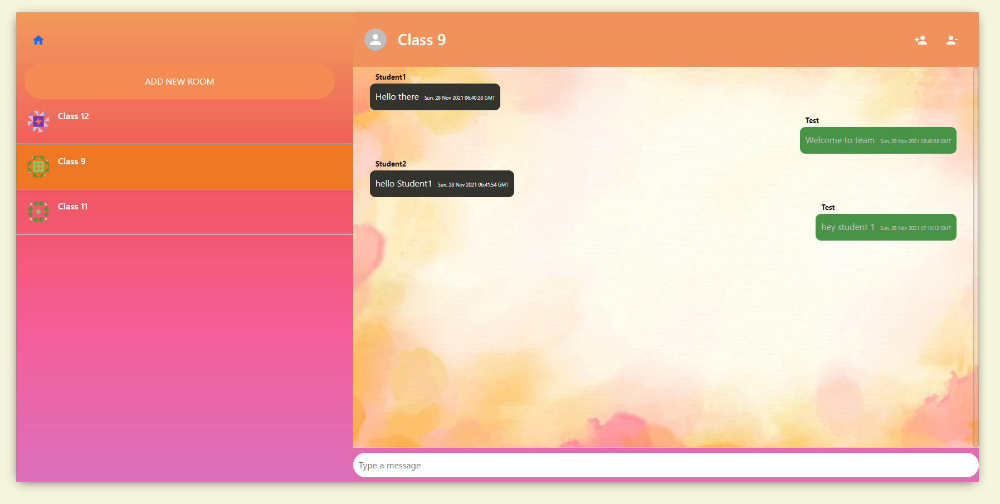
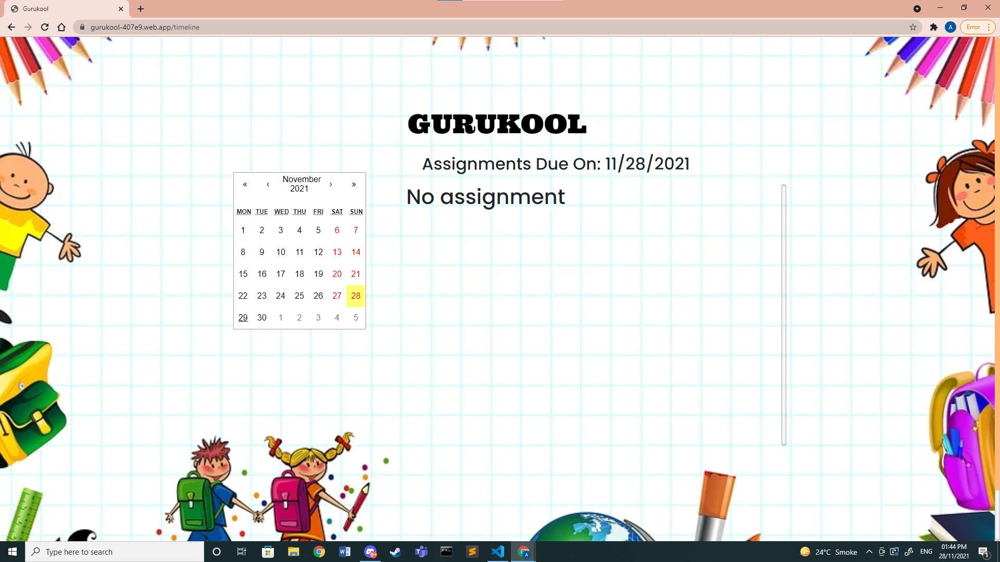
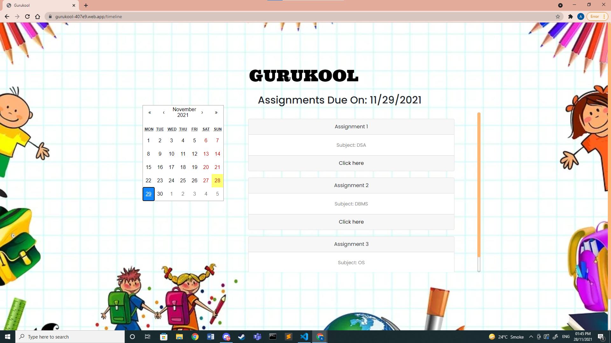
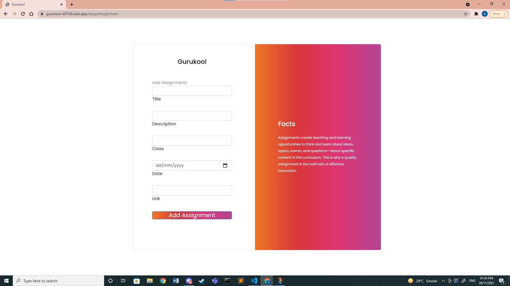

[![Contributors][contributors-shield]][contributors-url]
[![Forks][forks-shield]][forks-url]
[![Stargazers][stars-shield]][stars-url]
[![Issues][issues-shield]][issues-url]
[![MIT License][license-shield]][license-url]
[![LinkedIn][linkedin-shield]][linkedin-url]

<!-- PROJECT LOGO -->
 

  

<h3 align="center">Gurukool</h3>

  

    Gurukool is built to make teaching and learning easier for everyone, from the littlest learners to college faculty to business leaders. Our only moto is to make learning fun and easy for everyone.
     
    <a href="https://gurukool-407e9.web.app/">Visit Site</a>
    .
    <a href="https://github.com/ambuj0106/gurukool-app/issues">Request Feature</a>
  

<!-- TABLE OF CONTENTS -->

  
Table of Contents

  <ol>
    <li>
      <a href="#about-the-project">About The Project</a>
      <ul>
        <li><a href="#built-with">Built With</a></li>
      </ul>
    </li>
    <li>
      <a href="#getting-started">Getting Started</a>
      <ul>
        <li><a href="#prerequisites">Prerequisites</a></li>
        <li><a href="#installation">Installation</a></li>
      </ul>
    </li>
    <li><a href="#usage">Usage</a></li>
    <li><a href="#roadmap">Roadmap</a></li>
    <li><a href="#contributing">Contributing</a></li>
    <li><a href="#license">License</a></li>
    <li><a href="#contact">Contact</a></li>
    <li><a href="#acknowledgments">Acknowledgments</a></li>
  </ol>

<!-- ABOUT THE PROJECT -->

## About The Project

[![Gurukool][product-screenshot]](https://gurukool-407e9.web.app/)

(<a href="#top">back to top</a>)

### Built With

- [React.js](https://reactjs.org/)
- [Bootstrap](https://getbootstrap.com)
- [Firebase](https://firebase.google.com/)
- [Html](https://developer.mozilla.org/en-US/docs/Web/HTML)
- [CSS](https://en.wikipedia.org/wiki/CSS)
- [NodeJs](https://nodejs.org/)

(<a href="#top">back to top</a>)

<!-- GETTING STARTED -->

## Getting Started

This project was bootstrapped with [Create React App](https://github.com/facebook/create-react-app).

## Available Scripts

In the project directory, you can run:

### `npm start`

Runs the app in the development mode.\
Open [http://localhost:3000](http://localhost:3000) to view it in the browser.

The page will reload if you make edits.\
You will also see any lint errors in the console.

### `npm test`

Launches the test runner in the interactive watch mode.\
See the section about [running tests](https://facebook.github.io/create-react-app/docs/running-tests) for more information.

### `npm run build`

Builds the app for production to the `build` folder.\
It correctly bundles React in production mode and optimizes the build for the best performance.

The build is minified and the filenames include the hashes.\
Your app is ready to be deployed!

See the section about [deployment](https://facebook.github.io/create-react-app/docs/deployment) for more information.

### `npm run eject`

**Note: this is a one-way operation. Once you `eject`, you can’t go back!**

If you aren’t satisfied with the build tool and configuration choices, you can `eject` at any time. This command will remove the single build dependency from your project.

Instead, it will copy all the configuration files and the transitive dependencies (webpack, Babel, ESLint, etc) right into your project so you have full control over them. All of the commands except `eject` will still work, but they will point to the copied scripts so you can tweak them. At this point you’re on your own.

You don’t have to ever use `eject`. The curated feature set is suitable for small and middle deployments, and you shouldn’t feel obligated to use this feature. However we understand that this tool wouldn’t be useful if you couldn’t customize it when you are ready for it.

### Installation

1. `git clone https://github.com/ambuj0106/gurukool.git`
2. `cd ./gurukool-app`
3. Install node dependencies
   - `npm install`
4. Replace firebase API keys with your configurations
5. Create a `.env` file
   - Add relevant credentials
   - `cp .env.example .env`
6. `npm start`
7. The app is now running at http://localhost:3000/

(<a href="#top">back to top</a>)

<!-- USAGE EXAMPLES -->

## Usage

You can login as a Teacher(Admin) using given credentials

- Teacher1
  Email: Teacher1@gurukool.com
  Password: 123456
- Teacher2
  Email: Teacher2@gurukool.com
  Password: 123456

You can login as a Student using given credentials and Can make your own student account using Teacher account

- Student 1
  Email: Student1@gurukool.com
  Password: 123456
- Student 2
  Email: Student2@gurukool.com
  Password: 123456

(<a href="#top">back to top</a>)

<!-- ROADMAP -->

## Roadmap
- Login Page
</img>
- If user Try to Enter without Login 
  </img>
- Class Room UI
  </img>
- Class Room ADD Member
  </img>
- Class Room Remove Member
  </img>
- TimeLine (No assignment)
   </img>
- TimeLine (With assignment)
   </img>
-  Assign Assignment 
   </img>

See the [open issues](https://github.com/ambuj0106/gurukool-app/issues) for a full list of proposed features (and known issues).

(<a href="#top">back to top</a>)

<!-- CONTACT -->

## Contact

Ambuj - ambuj0106@gmail.com

Project Link: [https://github.com/ambuj0106/gurukool-app](https://github.com/ambuj0106/gurukool-app)

(<a href="#top">back to top</a>)

<!-- MARKDOWN LINKS & IMAGES -->

[contributors-shield]: https://img.shields.io/github/contributors/ambuj0106/gurukool-app.svg?style=for-the-badge
[contributors-url]: https://github.com/ambuj0106/gurukool-app/graphs/contributors
[forks-shield]: https://img.shields.io/github/forks/ambuj0106/gurukool-app.svg?style=for-the-badge
[forks-url]: https://github.com/ambuj0106/gurukool-app/network/members
[stars-shield]: https://img.shields.io/github/stars/ambuj0106/gurukool-app.svg?style=for-the-badge
[stars-url]: https://github.com/ambuj0106/gurukool-app/stargazers
[issues-shield]: https://img.shields.io/github/issues/ambuj0106/gurukool-app.svg?style=for-the-badge
[issues-url]: https://github.com/ambuj0106/gurukool-app/issues
[license-shield]: https://img.shields.io/github/license/ambuj0106/gurukool-app.svg?style=for-the-badge
[license-url]: https://github.com/ambuj0106/gurukool-app/blob/master/LICENSE.txt
[linkedin-shield]: https://img.shields.io/badge/-LinkedIn-black.svg?style=for-the-badge&logo=linkedin&colorB=555
[linkedin-url]: https://linkedin.com/in/ambuj00
[product-screenshot]: images/hp1.png
